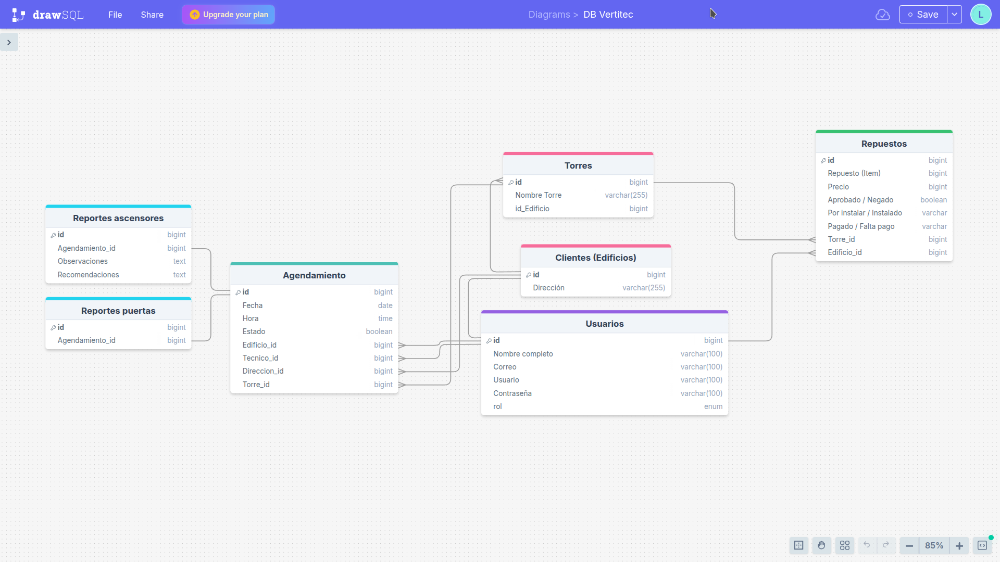

# 🚀 Plataforma Vertitec

La **Plataforma Vertitec** es una aplicación web en desarrollo, orientada a empresas de ingeniería (especialmente mantenimiento de ascensores). Está diseñada para facilitar la gestión de reportes técnicos, la comunicación con administraciones de edificios y el seguimiento de servicios realizados.

---

## 📝 Descripción

Esta plataforma permite a técnicos registrar los detalles de mantenimiento realizados en ascensores, mientras que administradores y clientes pueden consultar esa información de forma rápida, organizada y remota.

### 🎯 Propósito

- Digitalizar los reportes técnicos de mantenimiento.
- Agilizar el acceso a la información de los servicios realizados.
- Notificar automáticamente a los clientes sobre el estado de sus equipos y necesidades de repuestos.

### 🧩 Problemas que soluciona

- Elimina la gestión manual en papel.
- Ahorra tiempo en la comunicación entre técnicos y administradores.
- Centraliza el historial de servicios y necesidades técnicas por edificio.

---

## 👥 Roles y funcionalidades

### 👷 Técnico
- Ver agendamientos asignados y pendientes.
- Crear, ver, editar y eliminar agendamientos bajo el termino "No programado"
- Iniciar agendamientos y diligenciar formularios de servicio.
- Registrar observaciones, recomendaciones y checklist técnico.

### 🏢 Cliente / Edificio
- Ver historial y próximos agendamientos.
- Consultar repuestos instalados o pendientes.

### 🛠️ Administrador
- CRUD completo de:
  - Técnicos
  - Edificios
  - Torres
  - Agendamientos

---
## Diseño de la base de datos


## ✅ Funcionalidades actuales

- CRUD de técnicos
- CRUD de administradores
- CRUD de edificios/clientes
- CRUD de repuestos
- En el agendamiento, el campo de "Torres" depende de "Edificios"
- Buscador de edificios
- Paginación y filtros en listados
- Vistas de tecnicos y clientes, solo deben ver informacion relevante (Ej: Los cliente nos deben ver el campo "Edificio" ya que siempre sera el mismo valor para ellos)

---

## 🚧 Funcionalidades pendientes

- Mejorar setup_app para que cree todo lo necesario al desplegar
- Mostrar errores en los formularios (Ej: Si el usuario coloca texto en un campo que espera numeros)
- Los listados al ser vacios deben tener un texto como "No hay datos registrados" en lugar de aparecer vacios
- Cambiar orden en el que se envian los datos (Ej: Mostrar agendamiento por fecha actual o mas cercana)
- Añadir al agendamiento si pertenece a ascensor o puertas
- Formulario ascensores
- Formulario puertas
- Envio de correos (Notficaciones)
- Estilos responsive en todos los CRUD

---

## Agendamientos
- Se puede usar Formsets de Django para crear varios agendamientos de una vez
- ¿Como se genera el agendamiento recursivo? 
- Si el día no existe, ajustas al último día del mes. 
- Ejemplo: 
- 30 enero → 28 febrero (o 29 si es bisiesto), 30 marzo, etc. 
- 31 enero → 28/29 febrero, 31 marzo, 30 abril, etc. 
- Esto es lo que hacen algunos calendarios (ej. Google Calendar). 
- Ventaja: siempre hay un agendamiento cada mes. 
- Desventaja: la fecha no siempre coincide en número exacto.

---

## 🧰 Tecnologías utilizadas

- **Lenguaje:** Python 3.12.3
- **Framework:** Django
- **Frontend:** Bootstrap, HTML, CSS, JavaScript
- **Base de datos:** SQLite (por defecto en Django)

---

## ⚙️ Instalación

Sigue estos pasos para instalar el proyecto localmente:

```bash
# 1. Crear carpeta contenedora
mkdir Contenedor
cd Contenedor/

# 2. Clonar el repositorio
git clone https://github.com/WebAndromeda/Vertitec-Plataforma.git

# 3. Crear y activar entorno virtual
python3 -m venv env
source env/bin/activate

# 4. Instalar dependencias
cd Vertitec-Plataforma/
pip install -r requirements.txt

# 5. Aplicar migraciones
python manage.py migrate

# 6. Crear usuarios, grupos y demo inicial
python manage.py setup_app

# 7. Iniciar servidor
python manage.py runserver

 Instrucciones de uso
Accede a la plataforma desde: http://localhost:8000

Usuarios de prueba creados automáticamente por el comando setup_app:

Superusuario: root / chatgpt22
> Este usuario solo accede al panel de administración de Django, no a la plataforma principal.
> Si se intenta ingresar por el enlace normal, no tendrá acciones disponibles.
> Para acceder al panel de administración, añade al enlace de acceso a la plataforma: /admin
> Desde allí, el superusuario puede modificar usuarios y edificios, siendo además el único que puede eliminar técnicos o edificios, así como editar su información.

Administrador: admin / chatgpt22

Técnico: tech / chatgpt22

Cliente: cliente / chatgpt22


> Decoradores ubicados en:
utils/decorators.py

> Pasar variables globales a los templates para no hacerlo en cada "render()"
usuarios/context_processors.py
